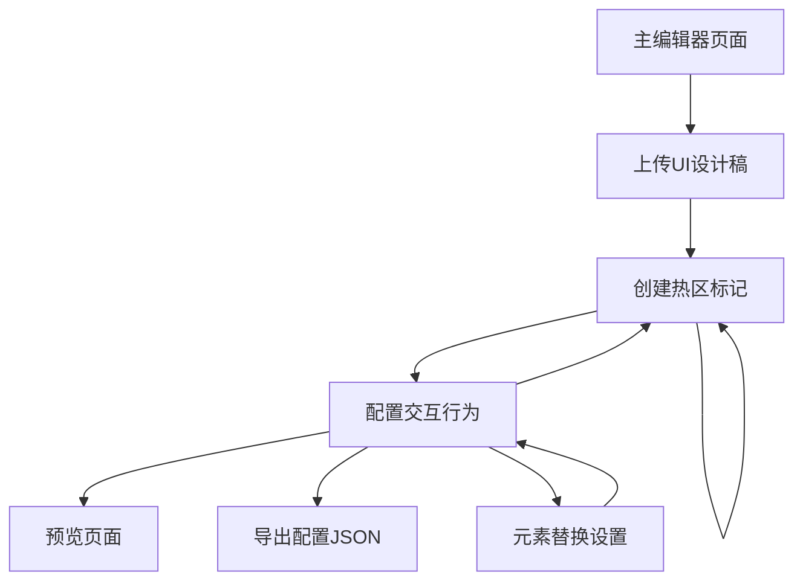

## 1. Product Overview
UI稿热区标记工具是一个基于React + Fabric.js的前端编辑器，让用户基于现有UI设计稿进行热区标记和元素替换。
- 解决UI设计稿转化为可交互页面的效率问题，让用户快速为静态设计稿添加交互功能
- 目标是提供一个专业的热区标记工具，支持点击区域标记、元素替换和配置导出

## 2. Core Features

### 2.1 User Roles
本产品采用单用户模式，无需区分用户角色，所有用户都具有完整的编辑权限。

### 2.2 Feature Module
我们的UI稿热区标记工具包含以下主要页面：
1. **主编辑器页面**：UI稿上传区、热区标记画布、属性配置面板
2. **预览页面**：带交互功能的H5预览展示页面

### 2.3 热区类型系统
支持以下热区类型，采用配置式管理便于扩展：
- **HOTSPOT (可点击热区)**：标记可点击区域，配置跳转或交互行为
- **REPLACEABLE (可替换元素)**：标记可替换的UI元素，如文本、图片、按钮等
- **VIDEO (视频区域)**：标记视频播放区域
- **GIF (动图区域)**：标记GIF动画显示区域

### 2.4 Page Details

| Page Name | Module Name | Feature description |
|-----------|-------------|---------------------|
| 主编辑器页面 | UI稿上传区 | 上传现有UI设计稿（支持JPG/PNG格式）、自适应画布尺寸、保持原始宽高比显示 |
| 主编辑器页面 | 热区标记画布 | 在UI稿上拖拽创建热区、选中移动缩放热区、可视化热区边界显示、热区层级管理 |
| 主编辑器页面 | 工具栏 | 生成预览按钮、导出配置JSON、清空所有热区、图层管理操作、热区复制粘贴 |
| 主编辑器页面 | 属性配置面板 | 热区类型选择、交互行为配置、元素替换设置、热区删除功能。当类型为HOTSPOT时显示交互行为配置；当类型为REPLACEABLE时显示元素替换选项；当类型为VIDEO/GIF时显示媒体配置 |
| 主编辑器页面 | 状态管理系统 | 热区数据管理、localStorage持久化、相对坐标计算、配置导出格式化 |
| 预览页面 | 预览展示 | 新标签页打开、还原UI稿原始尺寸、热区交互功能激活、元素替换效果展示 |

## 3. Core Process

用户操作流程：
1. 用户进入主编辑器页面
2. 上传现有UI设计稿作为标记基础
3. 在UI稿上拖拽创建热区标记可点击区域
4. 选中热区后在右侧属性面板配置交互行为和元素替换
5. 使用工具栏进行热区管理、预览或导出配置
6. 点击生成预览查看带交互功能的最终页面效果

## 4. User Interface Design

### 4.1 Design Style
- 主色调：蓝色系 (#3B82F6)，辅助色：灰色系 (#6B7280)，热区边框：红色系 (#EF4444)
- 按钮样式：圆角现代风格，hover效果，工具栏按钮紧凑排列
- 字体：系统默认字体，主要字号14px，标题16px
- 布局风格：两栏式布局，左侧70%标记区，右侧30%配置面板
- 热区样式：半透明填充，虚线边框，选中时高亮显示
- 图标风格：简洁线性图标，支持操作反馈和状态指示

### 4.2 Page Design Overview

| Page Name | Module Name | UI Elements |
|-----------|-------------|-------------|
| 主编辑器页面 | 整体布局 | 两栏式布局，左栏70%宽度，右栏30%宽度，顶部工具栏，Tailwind CSS样式 |
| 主编辑器页面 | 热区标记画布 | Fabric.js画布容器，UI稿背景显示，热区可视化边界，拖拽创建热区功能 |
| 主编辑器页面 | 属性配置面板 | 动态表单，热区类型下拉框，条件显示配置项，元素替换选项，删除按钮 |
| 主编辑器页面 | 工具栏 | 水平排列按钮组，上传UI稿、预览、导出、清空热区、图层控制按钮 |
| 预览页面 | 预览展示 | 原始UI稿尺寸展示，热区交互激活，元素替换效果，移动端适配 |

### 4.3 Responsiveness
产品采用桌面优先设计，主要面向PC端用户使用。编辑器界面针对桌面优化，预览页面支持移动端适配以确保最终效果在各设备上正常显示。热区标记画布支持自适应缩放以适应不同屏幕尺寸。