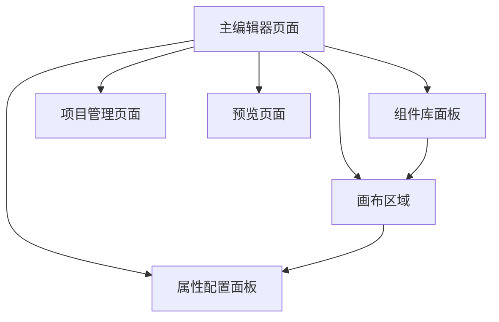

## 1. Product Overview

可视化页面搭建工具，支持通过拖拽组件的方式快速构建页面，提供丰富的UI组件库和实时预览功能。

* 解决传统页面开发效率低下的问题，让非技术人员也能快速搭建页面

* 目标是成为一个易用的低代码页面搭建平台，提升页面开发效率

## 2. Core Features

### 2.1 User Roles

| Role | Registration Method | Core Permissions  |
| ---- | ------------------- | ----------------- |
| 默认用户 | 直接访问                | 可以使用所有组件拖拽和页面搭建功能 |

### 2.2 Feature Module

我们的可视化页面搭建工具包含以下主要页面：

1. **主编辑器页面**：组件库面板、画布区域、属性配置面板
2. **项目管理页面**：项目创建、导入导出、项目列表
3. **预览页面**：实时预览搭建的页面效果

### 2.3 Page Details

| Page Name | Module Name | Feature description            |
| --------- | ----------- | ------------------------------ |
| 主编辑器页面    | 组件库面板       | 显示可拖拽的UI组件，包括按钮、图片、文本、输入框等基础组件 |
| 主编辑器页面    | 画布区域        | 支持组件拖拽放置、选中编辑、位置调整、层级管理        |
| 主编辑器页面    | 属性配置面板      | 编辑选中组件的样式、内容、交互行为等属性           |
| 主编辑器页面    | 工具栏         | 撤销重做、保存、预览、导出等操作功能             |
| 项目管理页面    | 项目列表        | 显示所有项目，支持新建、删除、重命名项目           |
| 项目管理页面    | 导入导出        | 支持项目配置的JSON格式导入导出              |
| 预览页面      | 实时预览        | 以最终用户视角预览搭建的页面效果               |

## 3. Core Process

**主要用户操作流程：**

1. 用户进入主编辑器页面
2. 从左侧组件库选择需要的组件（按钮、图片、文本等）
3. 拖拽组件到中间画布区域进行布局
4. 点击选中组件，在右侧属性面板编辑组件属性
5. 使用工具栏功能进行保存、预览等操作
6. 通过项目管理进行项目的创建、导入导出

## 4. User Interface Design

### 4.1 Design Style

* **主色调**：蓝色系 (#3B82F6) 作为主色，灰色系 (#F3F4F6, #E5E7EB) 作为辅助色

* **按钮样式**：圆角矩形，悬停时有阴影效果

* **字体**：系统默认字体，标题16px，正文14px，小字12px

* **布局风格**：三栏布局，左侧组件库、中间画布、右侧属性面板

* **图标风格**：使用Lucide React图标库，线性风格

### 4.2 Page Design Overview

| Page Name | Module Name | UI Elements                    |
| --------- | ----------- | ------------------------------ |
| 主编辑器页面    | 组件库面板       | 白色背景，组件分类标签，组件图标+名称的卡片式布局，支持拖拽 |
| 主编辑器页面    | 画布区域        | 浅灰色背景，网格辅助线，组                  |

